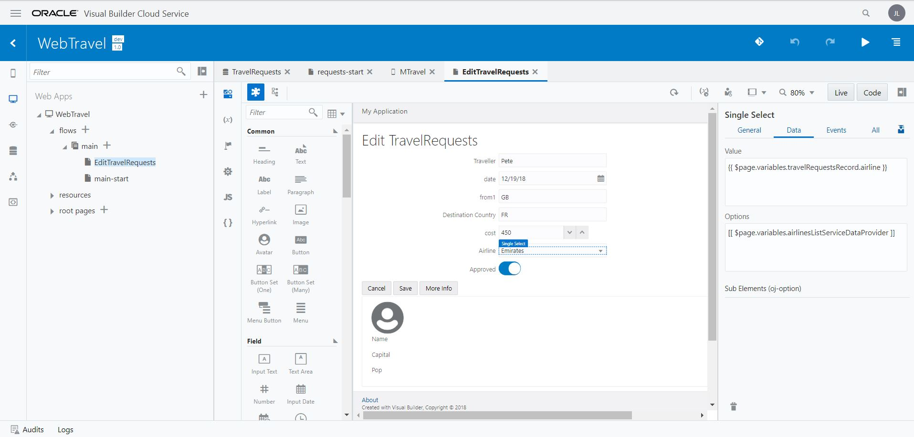
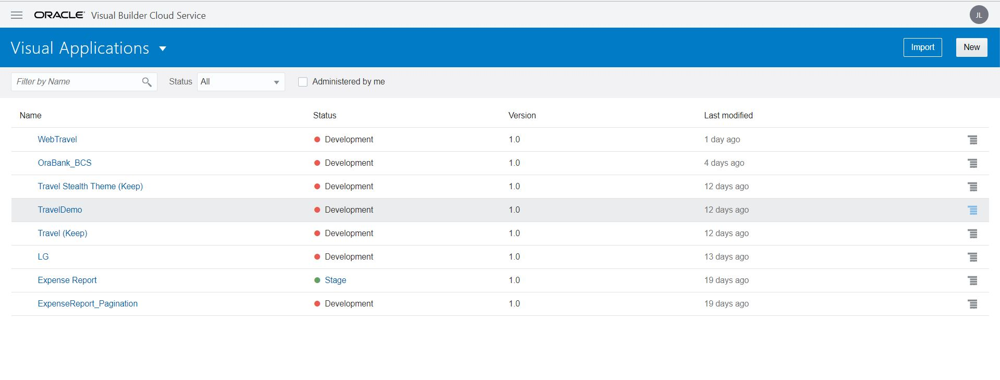

[Go to the Cloud Test Drive Overview](../../README.md)

# Visual Builder Cloud Service Lab #

## Use visual development to easily build sophisticated Web or Mobile apps

### Introduction ###

Oracle Visual Builder Cloud Service is a visual development tool for creating web and mobile applications by simply dragging and dropping user interface (UI) components onto a page. It is aimed at professional developers who want to enhance their productivity by using a low-code tool to help build javascript apps. You can create business objects with the click of a button, and you can add data by importing CSV files or XLS spreadsheets to your application. Since there are QuickStarts (Wizards) for most common actions you don't need any programming experience to develop an application. Alternatively, you can extend the functionality and change the appearance of your apps at any point using standard HTML, CSS and javascript. You can switch between visual and code mode as required.

This lab will first showcase the development of a simple HR application, based on a "Department and an "Employee" data object.  Next we will see how you can connect to an external REST API, and finally how you can use VBCS to extend SaaS applications.

Developing a simple HR application 

You'll create a Human Resources (HR) application to list all employees and departments of your organization. Using the application, you can add, edit, or remove employees and departments from the database.
In this tutorial, you'll learn how to:
+ Create the HR Application web application
+ Edit the properties of the application and add the application logo, add tab icons, and update the copyright text
+ Create Employee and Department business objects
+ Create application form pages to add, edit, and view the data of Employee and Department business objects
+ Test the application in Test Application mode
+ Add data manually to the business objects
+ Import data from a CSV file

Follow the links provided during the workshop to access the Visual Builder Console. You should land on a screen similar to the one below:

Now execute the first part of this lab following the instructions of the tutorial below, using the "+" buttons to expand the sections. After you have finished the "Getting Started with Oracle Visual Builder Cloud Service" lab, use the "Back" button of your browser to come back to this page

+ Step 1 : [Oracle Visual Builder Cloud Service - Tutorial](https://docs.oracle.com/en/cloud/paas/app-builder-cloud/tutorials.html)

---

## License ##
Copyright (c) 2014, 2017 Oracle and/or its affiliates
The Universal Permissive License (UPL), Version 1.0   
[Details](../../common/license.md)

---
[Go to the Cloud Test Drive Overview](../../README.md)
